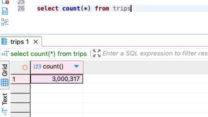
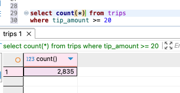
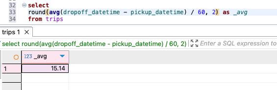
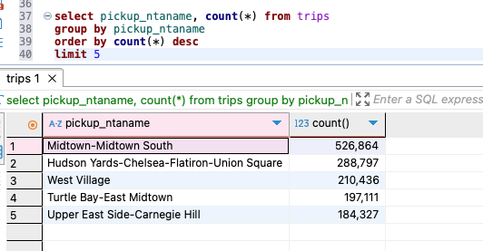
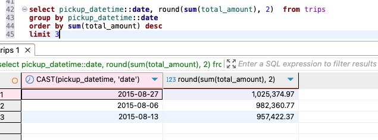

Посчитать общее количество записей в таблице (сколько всего поездок) 

Найти, сколько поездок сопровождались «крупными» чаевыми (больше $20) 

Определить среднюю продолжительность поездки в минутах 

Найти 5 самых популярных зон для начала поездки и вывести их названия вместе с количеством поездок 

Найти топ-3 дня, в которые была наибольшая суммарная выручка 
