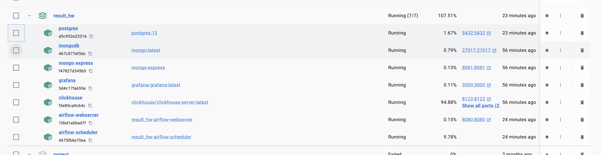
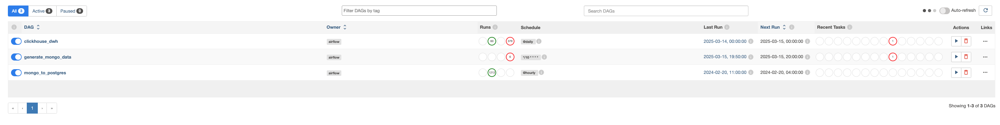
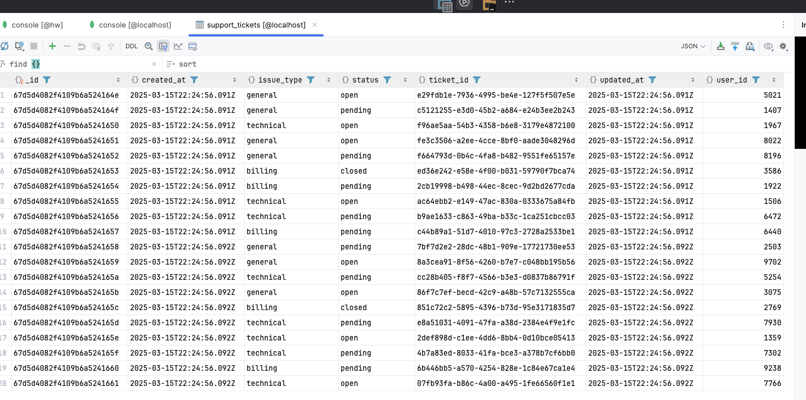

# ETL Pipeline with Airflow, MongoDB, PostgreSQL and ClickHouse

Система для управления ETL-процессами с использованием Apache Airflow. Включает генерацию тестовых данных, репликацию между базами данных и создание аналитических витрин.

## 📋 Основные возможности

- **Генерация тестовых данных** в MongoDB каждые 10 минут
- **Репликация данных** в PostgreSQL каждый час
- **Создание аналитических витрин** в ClickHouse ежедневно

## 🚀 Быстрый старт

### Требования
- Docker 20.10+
- Docker Compose 2.0+

### Установка
```bash
git clone https://github.com/K7chyp/etl.git
cd result_hw
docker-compose up --build
```

Система будет доступна через 2-3 минуты. По умолчанию используются порты:

- Airflow UI: http://localhost:8080
- PostgreSQL: 5432
- MongoDB: 27017
- ClickHouse: 8123


### 🔄 Кастомные DAGи
## 1. Генерация данных  
**Расписание**: Каждые 10 минут  
**Задачи**:  
- Генерация пользовательских сессий  
- Создание тикетов поддержки  
- Логирование событий  

## 2. Репликация в PostgreSQL  
**Расписание**: Каждый час  
**Особенности**:  
- Контроль дубликатов  
- Трансформация JSON-данных  
- Обработка ошибок с ретраями  

## 3. Аналитические витрины  
**Расписание**: Ежедневно в 00:00  
**Создаваемые таблицы**:  
- `user_activity_daily`  
- `device_usage_stats`  
- `support_performance`  

# 📸 Картинки

## Airflow + Docker


## MongoDB
### support_tickets
